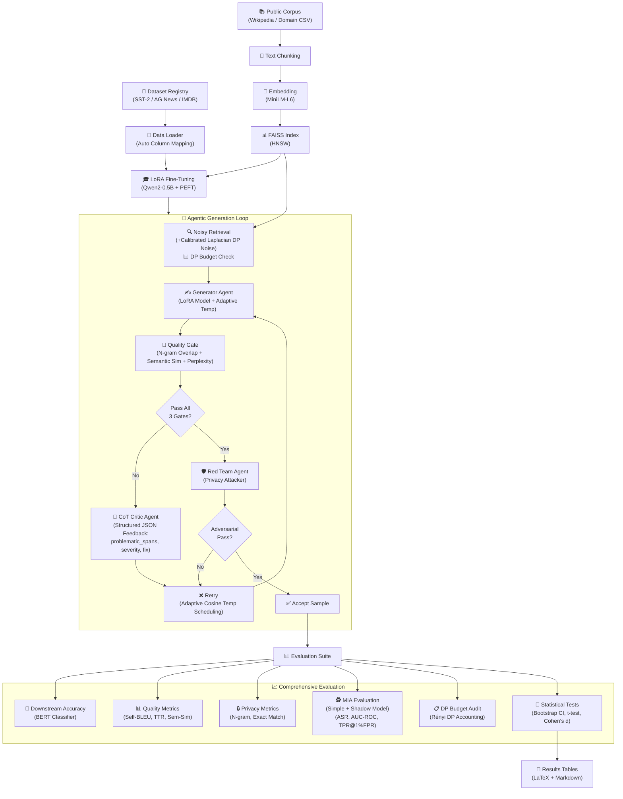
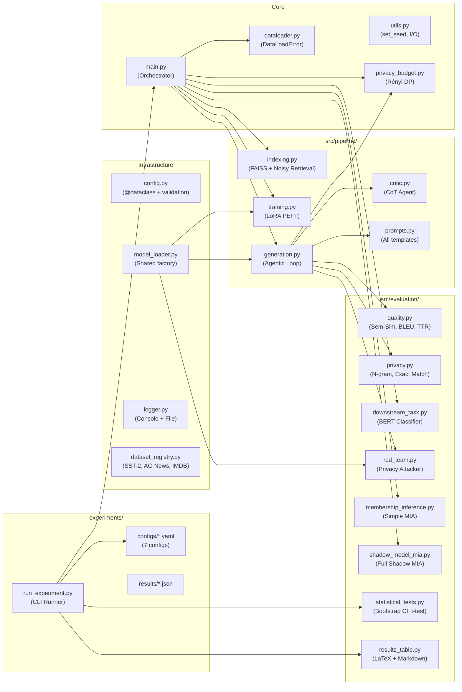
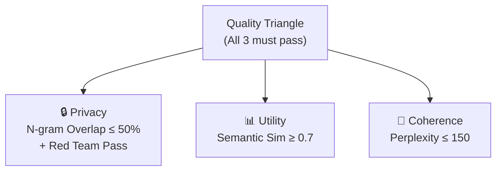
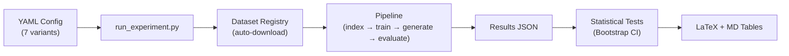

# Architecture Flow — PrivaSyn

## System Overview

```mermaid
flowchart TD
    A["📂 Dataset Registry\n(SST-2 / AG News / IMDB)"] --> B["📄 Data Loader\n(Auto Column Mapping)"]
    C["📚 Public Corpus\n(Wikipedia / Domain CSV)"] --> D["🔪 Text Chunking"]
    D --> E["🧮 Embedding\n(MiniLM-L6)"]
    E --> F["📊 FAISS Index\n(HNSW)"]

    B --> G["🎓 LoRA Fine-Tuning\n(Qwen2-0.5B + PEFT)"]
    F --> G

    subgraph GENERATION["🔄 Agentic Generation Loop"]
        direction TB
        H["🔍 Noisy Retrieval\n(+Calibrated Laplacian DP Noise)\n📊 DP Budget Check"]
        I["✍️ Generator Agent\n(LoRA Model + Adaptive Temp)"]
        J["📏 Quality Gate\n(N-gram Overlap + Semantic Sim + Perplexity)"]
        K{"Pass All\n3 Gates?"}
        L["🧠 CoT Critic Agent\n(Structured JSON Feedback:\nproblematic_spans, severity, fix)"]
        M["🛡️ Red Team Agent\n(Privacy Attacker)"]
        N{"Adversarial\nPass?"}
        O["✅ Accept Sample"]
        P["❌ Retry\n(Adaptive Cosine Temp Scheduling)"]

        H --> I --> J --> K
        K -- No --> L --> P --> I
        K -- Yes --> M --> N
        N -- No --> P
        N -- Yes --> O
    end

    G --> GENERATION
    F --> H

    O --> Q["📊 Evaluation Suite"]

    subgraph EVAL["📈 Comprehensive Evaluation"]
        R["🎯 Downstream Accuracy\n(BERT Classifier)"]
        S["📊 Quality Metrics\n(Self-BLEU, TTR, Sem-Sim)"]
        T["🔒 Privacy Metrics\n(N-gram, Exact Match)"]
        U["🕵️ MIA Evaluation\n(Simple + Shadow Model)\n(ASR, AUC-ROC, TPR@1%FPR)"]
        V["📋 DP Budget Audit\n(Rényi DP Accounting)"]
        W["📐 Statistical Tests\n(Bootstrap CI, t-test, Cohen's d)"]
    end

    Q --> R & S & T & U & V & W

    W --> X["📄 Results Tables\n(LaTeX + Markdown)"]
```

## Component Map

```mermaid
graph LR
    subgraph INFRA["Infrastructure"]
        CONFIG["config.py\n(@dataclass + validation)"]
        LOADER["model_loader.py\n(Shared factory)"]
        LOGGER["logger.py\n(Console + File)"]
        REGISTRY["dataset_registry.py\n(SST-2, AG News, IMDB)"]
    end

    subgraph SRC["Core"]
        MAIN["main.py\n(Orchestrator)"]
        DL["dataloader.py\n(DataLoadError)"]
        UTILS["utils.py\n(set_seed, I/O)"]
        PB["privacy_budget.py\n(Rényi DP)"]
    end

    subgraph PIPELINE["src/pipeline/"]
        IDX["indexing.py\n(FAISS + Noisy Retrieval)"]
        TRAIN["training.py\n(LoRA PEFT)"]
        GEN["generation.py\n(Agentic Loop)"]
        CRITIC["critic.py\n(CoT Agent)"]
        PROMPTS["prompts.py\n(All templates)"]
    end

    subgraph EVALUATION["src/evaluation/"]
        QUAL["quality.py\n(Sem-Sim, BLEU, TTR)"]
        PRIV["privacy.py\n(N-gram, Exact Match)"]
        DS["downstream_task.py\n(BERT Classifier)"]
        RT["red_team.py\n(Privacy Attacker)"]
        MIA_S["membership_inference.py\n(Simple MIA)"]
        MIA_F["shadow_model_mia.py\n(Full Shadow MIA)"]
        STATS["statistical_tests.py\n(Bootstrap CI, t-test)"]
        TABLES["results_table.py\n(LaTeX + Markdown)"]
    end

    subgraph EXPERIMENTS["experiments/"]
        RUNNER["run_experiment.py\n(CLI Runner)"]
        CONFIGS["configs/*.yaml\n(7 configs)"]
        RESULTS["results/*.json"]
    end

    MAIN --> DL & IDX & TRAIN & GEN
    GEN --> CRITIC & PROMPTS & QUAL & PRIV & RT & PB
    MAIN --> DS & MIA_S & MIA_F & PB
    RUNNER --> MAIN & CONFIGS & TABLES & STATS
    LOADER --> TRAIN & GEN & RT
```

## Quality Triangle

```mermaid
graph TD
    QT["Quality Triangle\n(All 3 must pass)"]
    QT --> PRIVACY["🔒 Privacy\nN-gram Overlap ≤ 50%\n+ Red Team Pass"]
    QT --> UTILITY["📊 Utility\nSemantic Sim ≥ 0.7"]
    QT --> COHERENCE["📝 Coherence\nPerplexity ≤ 150"]
```

## Experiment Workflow

```mermaid
flowchart LR
    A["YAML Config\n(7 variants)"] --> B["run_experiment.py"]
    B --> C["Dataset Registry\n(auto-download)"]
    C --> D["Pipeline\n(index → train → generate → evaluate)"]
    D --> E["Results JSON"]
    E --> F["Statistical Tests\n(Bootstrap CI)"]
    F --> G["LaTeX + MD Tables"]
```
